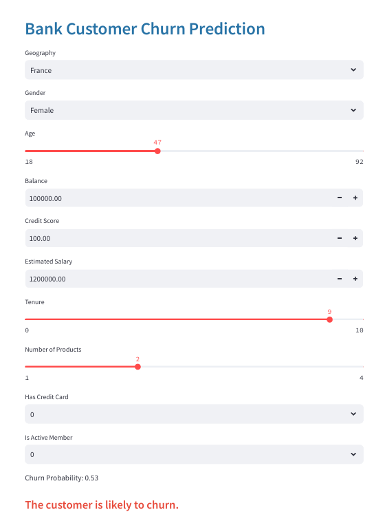

<h1> Bank Customer Churn Prediction </h1>

<h2><strong>Project Overview</strong></h2>
Developed an end-to-end Bank Customer Churn Prediction solution using an Artificial Neural Network (ANN), achieving high accuracy. The solution includes a real-time prediction interface built with Streamlit, enabling the bank to predict customer churn effectively.

<h3><strong>Data Source</strong></h3>
The dataset is available for download from Kaggle as a CSV file. It includes information such as customer demographics, account details, and transaction history.

<h3><strong>Tools & Technologies</strong></h3>
<ul>
    <li><strong>Programming Languages:</strong> Python</li>
    <li><strong>Libraries:</strong> NumPy, Pandas, Scikit-Learn, TensorFlow</li>
    <li><strong>Development Tools:</strong> Jupyter Notebook, VS Code, Git, Streamlit</li>
</ul>

<h3><strong>Key Features</strong></h3>
<ul>
    <li>Exploratory Data Analysis (EDA) to understand customer data and churn patterns.</li>
    <li>Feature Engineering to enhance model performance.</li>
    <li>Development and training of an Artificial Neural Network (ANN) for churn prediction.</li>
    <li>Real-time customer churn prediction interface developed using Streamlit.</li>
    <li>Model evaluation and validation to ensure high accuracy.</li>
</ul>

<h3><strong>Usage</strong></h3>
<ol>
    <li>Clone this repository:  
       <code>git clone https://github.com/YourUsername/Bank-Customer-Churn-Prediction.git</code>
    </li>
    <li>Install required dependencies:  
       <code>pip install -r requirements.txt</code>
    </li>
    <li>Run the notebook or script to train and evaluate the model.</li>
    <li>Launch the real-time prediction UI using Streamlit by running:  
       <code>streamlit run app.py</code>
    </li>
</ol>

<h3><strong>Results</strong></h3>
The model achieved high accuracy in predicting customer churn, providing valuable insights for banks to take preventive actions and improve customer retention.

<h3><strong>Contributions</strong></h3>
Contributions are welcome! Feel free to fork this repository, create a branch, and submit a pull request.

<h3><strong>License</strong></h3>
This project is licensed under the <a href="https://opensource.org/licenses/MIT">MIT License</a>.
